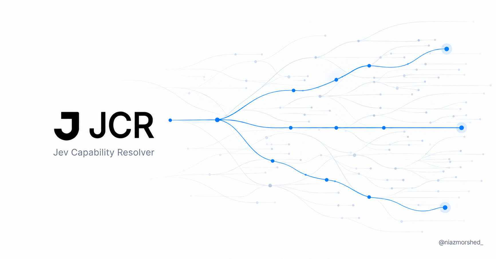
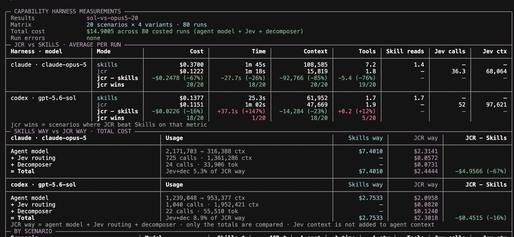

# JCR · Jev Capability Resolver

[](https://jcr.niazmorshed.dev)

JCR gives an agent one tool to find the documented commands it needs for a task.
It uses [Jev](https://typesafe.ai/blog/introducing-system-one-models-and-jev) to
search a nested capability tree and return the context attached to selected
operations.

Skills made it easier to load instructions when they are needed. But an agent
can still read several files to find a few commands, then carry those files
through the rest of the task. JCR moves that lookup into a resolver. The main
agent gets the selected instructions while the search stays outside its context.

I built this around a proposed capabilities format for **deterministic commands**
from any provider. Skills can describe a workflow and the judgment it needs.
Capabilities can document the individual operations used along the way. The
format is independent of Jev, and I would like to explore whether it should
become an open standard with the community.

**[Read the article and watch the demo](https://jcr.niazmorshed.dev)** ·
[Quick start](#quick-start) · [Capability format](#capability-format) ·
[Benchmarks](#benchmarks) · [Contributing](#contributing)

This repository includes the resolver, a capability catalog, a stdio MCP
server, Claude and Codex comparison harnesses, and 50 benchmark scenarios.
JCR returns documentation. It does not execute commands. The included
harnesses also stop at explaining the steps needed to carry out a task.

## Quick start

Use Node.js 22 or newer and npm. Clone the repository and install its dependencies.

```bash
git clone https://github.com/NiazMorshed2007/jcr.git
cd jcr
npm ci
cp .env.example .env
```

Run the remaining commands from the repository root.

Fill in the keys in `.env` for the mode you want to run. For an API-key setup,
the requirements are as follows.

| Entry point               | Keys                                                            |
| ------------------------- | --------------------------------------------------------------- |
| Resolver without an agent | `TYPESAFE_API_KEY`, plus `OPENAI_API_KEY` for compound requests |
| Claude in skills mode     | `ANTHROPIC_API_KEY`                                             |
| Claude in JCR mode        | `ANTHROPIC_API_KEY`, `TYPESAFE_API_KEY`, `OPENAI_API_KEY`       |
| Codex in skills mode      | `OPENAI_API_KEY`                                                |
| Codex in JCR mode         | `OPENAI_API_KEY`, `TYPESAFE_API_KEY`                            |
| Full comparison benchmark | All three keys                                                  |

The OpenAI key in a JCR run is also used by the decomposer when Jev classifies
a request as compound. Single-step requests skip decomposition. The Codex
harness runs with an isolated home directory, so it does not reuse your usual
Codex login.

Check the catalog locally, then try the resolver.

```bash
npm run capabilities:audit
npm run jcr:resolve -- --agent-output "Create a Stripe customer"
```

The audit needs no API keys. Resolving requests and running agents call model
APIs and incur usage charges. No Stripe, Slack, or other target-service
credentials are needed to look up their instructions.

The checkout is the current way to run JCR. The root package is private and
is not published as an npm library.

## Running an agent

Pass a request and choose a provider and mode interactively.

```bash
npm start -- "Create a Stripe customer, then post its link in Slack"
```

For scripts or a specific harness, set the provider and mode explicitly.

```bash
npm run claude:jcr -- --prompt "Refund the duplicate charge pi_123"
npm run codex:jcr -- --prompt "Create a Linear issue for the failing build"
npm run codex -- --mode skills --prompt "Deploy this project to Railway"
npm run claude -- --mode skills --claude-model haiku --prompt "Create a Stripe customer"
```

Run one request through skills first and JCR second with the same provider.
The comparison prints context, cost, timing, and tool usage.

```bash
npm run compare -- claude "Create a Stripe customer, then post its link in Slack"
```

`compare` uses the models configured in `.env`. The agent CLI also accepts
`--claude-model`, `--codex-model`, and `--metrics-file <path>`. Requests
can come from positional text, `--prompt`, or stdin. Run
`npm start -- --help` for the full options.

| Mode     | Claude harness                                             | Codex harness                            |
| -------- | ---------------------------------------------------------- | ---------------------------------------- |
| `skills` | Project skills through `Read`, `Glob`, `Grep`, and `Skill` | Local `skill_loader.load_skill` MCP tool |
| `jcr`    | `resolve_capabilities` MCP tool                            | `resolve_capabilities` MCP tool          |

Skills are bundled under [`.agents/skills/`](.agents/skills/) and linked from
`.claude/skills/`. In JCR mode the harness does not expose the skill catalog
or filesystem tools to the agent. These are different discovery mechanisms
with different tool access, which matters when interpreting comparisons.

## How resolution works

For a request such as creating a customer and posting its link in Slack,
the resolver first separates the required operations. It can then search
the payments branch for one step and the communication branch for another.
Each search opens progressively narrower groups until it reaches individual
items.

1. **Classify the request.** Jev chooses whether it needs one external action
   or several.
2. **Split compound requests.** The configured OpenAI model breaks the request
   into steps while preserving the details and dependencies. Single-step
   requests skip this call.
3. **Search each step in parallel.** At each node, Jev ranks its direct
   children using their names and descriptions, with a no-match option.
   Questions for the open paths in one step's search round are batched together.
4. **Keep promising paths.** A beam search scores each path using the
   geometric mean of its routing probabilities. By default it keeps up to
   three paths whose score is at least 60% of the best, allowing close
   alternatives to be explored further.
5. **Return the selected context.** The agent receives item paths and their
   `context` text. Search trails, discarded branches, and scores stay in
   diagnostics.

Several close matches can be returned for the agent to choose between. Too
many close item matches produce an ambiguity response. No-match and
depth-limit outcomes are explicit, so the caller can narrow the request or
ask for clarification.

The commands being documented can be deterministic. The model-based choice
of which command fits a request is probabilistic.

## Capability format

A capability is an item with routing metadata and a self-contained instruction
payload. The catalog is a directory tree containing `index.json` and
`items.json` files. It has no dependency on a specific provider or agent SDK.

A minimal catalog looks like this.

```text
capabilities/
  git/
    index.json
    items.json
```

`git/index.json` describes the group.

```json
{
  "id": "git",
  "name": "Git",
  "description": "Inspect and manage version-controlled repositories."
}
```

`git/items.json` contains its operations.

```json
[
  {
    "id": "list-tracked-files",
    "name": "List tracked files",
    "description": "List file paths tracked by Git in the current repository.",
    "context": "Run git ls-files from the repository root.\nRequires Git and an existing checkout.\nReturns tracked file paths, one per line. Does not include untracked files."
  }
]
```

When this item is selected, the agent-facing output is the path followed by
the documented context.

```text
git/list-tracked-files
Run git ls-files from the repository root.
Requires Git and an existing checkout.
Returns tracked file paths, one per line. Does not include untracked files.
```

Groups can contain subgroups, items, or both. Nesting is unlimited in the
**format**. If a group gets too large, split its commands into subgroups and
repeat at any level, such as `git/repository/files/...`.

The current resolver has a separate budget of **16 routing rounds per step**,
defined in [`src/jcr/resolve.ts`](src/jcr/resolve.ts). It reports a depth-limit
result when that budget is exhausted. Nodes with more than 240 children are
handled by chunking and reranking finalists, but smaller, meaningful groups
are the recommended way to organize a growing catalog.

### Authoring rules

The loader and `npm run capabilities:audit` enforce the following structure.

- The catalog root contains only group directories. It has no `index.json`
  or `items.json` of its own.
- Every directory below the root has an `index.json` with exactly `id`,
  `name`, and `description`. All three are non-empty strings, and `id`
  matches the directory name.
- An optional `items.json` is an array. Each item has exactly `id`, `name`,
  `description`, and `context`, all non-empty strings.
- Item IDs contain no path separators and are unique within their node.
  A direct item and a child directory cannot share an ID.
- Every node has at least one item or subgroup. Only the two JSON file types
  and child directories are allowed inside it.

Write names and descriptions that distinguish neighboring operations. Put the
actual command or endpoint, parameters, prerequisites, required credentials,
and expected result in `context`. Use placeholders for runtime values.
The agent does not receive parent-node descriptions as execution instructions,
so each item's context needs to stand on its own.

The bundled catalog has **11 groups, 960 nodes, and 11,360 items**, with a
maximum node depth of 6 and a largest direct child set of 175. The audit prints
updated counts after changes. It validates structure and skill mappings,
not the completeness or freshness of provider documentation.

## Using JCR in another harness

The tool is named `resolve_capabilities` and takes one argument.

```json
{
  "request": "Create a Stripe customer, then post its link in Slack"
}
```

Pass the complete request, including dependent steps. The tool returns text
containing the selected paths and contexts, grouped by step for compound
requests. A harness can use those instructions with its own execution tools.
It remains responsible for supplying values, managing credentials, handling
dependencies between actions, and checking their results.

### MCP server

Launch [`src/jcr/server.ts`](src/jcr/server.ts) as a stdio MCP server.
For a client that supports a command, arguments, working directory, and
environment, use these settings.

| Setting           | Value                                                             |
| ----------------- | ----------------------------------------------------------------- |
| Command           | `node`                                                            |
| Arguments         | `["--env-file=.env", "--import", "tsx", "src/jcr/server.ts"]`     |
| Working directory | Absolute path to your JCR checkout                                |
| Environment       | `CAPABILITIES_DIRECTORY` set to the absolute path of your catalog |

The equivalent shell command, run from the repository root, is below.

```bash
CAPABILITIES_DIRECTORY="$PWD/capabilities" \
  node --env-file=.env --import tsx src/jcr/server.ts
```

The server waits for an MCP client on stdin. Use `jcr:resolve` for a human-facing
CLI instead. Unlike the CLI, the server does not load `.env` itself, which is
why the launch command includes `--env-file`.

The local integration functions are in [`src/jcr/tool.ts`](src/jcr/tool.ts).
`handleCapabilityResolution(request, { capabilitiesDirectory })` returns the
agent-facing text, while `createJcrSdkServer` wraps the same handler for the
Claude Agent SDK. These are source-level entry points within this checkout.

### Diagnostics and configuration

Omit `--agent-output` to inspect the full resolution and usage metrics.

```bash
npm run jcr:resolve -- "Create a Stripe customer"
```

For an MCP session, setting `JCR_METRICS_FILE` writes resolution details and
metrics as NDJSON. Its parent directory must already exist.

| Variable              | Purpose                                 | Default                                            |
| --------------------- | --------------------------------------- | -------------------------------------------------- |
| `CLAUDE_MODEL`        | Claude agent model                      | `haiku`                                            |
| `CODEX_MODEL`         | Codex agent model                       | `gpt-5.6-luna`                                     |
| `TYPESAFE_MODEL`      | Jev routing model                       | `jev-latest`                                       |
| `JCR_OPENAI_MODEL`    | Compound-request decomposer             | `gpt-5.6-luna`                                     |
| `JCR_BEAM_WIDTH`      | Maximum retained paths per step         | `3`                                                |
| `JCR_BAND_RATIO`      | Minimum path score relative to the best | `0.6`                                              |
| `AGENT_MODE`          | CLI mode when `--mode` is omitted       | Interactive choice, or `skills` without a terminal |
| `BENCH_CLAUDE_MODELS` | Comma-separated benchmark model list    | `CLAUDE_MODEL`, then `haiku`                       |
| `BENCH_CODEX_MODELS`  | Comma-separated benchmark model list    | `CODEX_MODEL`, then `gpt-5.6-luna`                 |

CLI model flags take precedence over environment values. Beam width must be
a positive integer, and the band ratio must be greater than zero and at most
one. Invalid beam settings fall back to the defaults. A wider beam can explore
more candidates and require more routing work.

## Benchmarks

The latest `sol-vs-opus5-20` measurement ran **20 scenarios across four variants**.
It compared skills and JCR in the Claude harness with **Claude Opus 5** and the
Codex harness with **GPT-5.6-Sol**, giving **80 runs**.

Both modes only looked up instructions and explained the steps required for
each task. They did not execute those steps.

[](web/public/jcr-benchmark-sol-opus.png)

The figures below are **averages per run**, with skills first and JCR second.

| Harness and model      | Agent input tokens | Total cost        | Wall time      |
| ---------------------- | ------------------ | ----------------- | -------------- |
| Claude with Opus 5     | 108,585 → 15,819   | $0.3700 → $0.1222 | 105.5s → 77.7s |
| Codex with GPT-5.6-Sol | 61,952 → 47,669    | $0.1377 → $0.1151 | 25.3s → 62.4s  |

JCR reduced average agent input by **85% with Opus 5** and **23% with Sol**.
Average total cost fell by **67% and 16%**, respectively, including the agent
model, Jev routing, and compound-request decomposition.

Context here means cumulative input tokens processed by the main agent across
the run, including cached tokens. It is not the size of a single context
window. Jev input is reported separately and is not added to agent context.

The timing result was mixed. Median wall time went from **86.6s to 57.5s** for
Opus 5 and **23.2s to 45.4s** for Sol. One Sol JCR run took 372.6s with two
resolver calls and 193 Jev calls, pulling up the mean. Sol was still slower
with JCR in 19 of 20 scenarios, so the outlier explains only part of the gap.

Wall time covers the whole agent run, including startup, generation, and tool
calls. Runs overlapped, and output lengths differed between modes. There was
only one run per scenario and variant. Repeated runs with timings for each
stage would help separate resolver latency from harness behavior and API
variation. All 80 runs completed without runtime errors.

Every scenario integration has an installed skill, but skills and capability
entries are different documents. Read these measurements as a comparison of
the included instruction-lookup setups, rather than a task-execution benchmark.

### Run your own comparison

Preview the same 20-scenario model matrix without calling any models.

```bash
npm run bench -- \
  --providers claude,codex \
  --modes skills,jcr \
  --claude-models claude-opus-5 \
  --codex-models gpt-5.6-sol \
  --limit 20 \
  --concurrency 4 \
  --timeout 600 \
  --dry-run
```

Remove `--dry-run` to run it. You need API access to the selected models.
The 600-second timeout allows room for slow runs. Concurrency is explicit so
you can keep it consistent across comparisons.

For a smaller first run, use one provider and one scenario.

```bash
npm run bench -- --providers codex --limit 1 --batch-id first-comparison
npm run bench:report -- --batch first-comparison
```

The benchmark defaults to all 50 scenarios, both providers, both modes,
four concurrent runs, and a 300-second timeout per run.

| Option                              | Use                                                  |
| ----------------------------------- | ---------------------------------------------------- |
| `--providers`, `--modes`            | Comma-separated provider and mode selections         |
| `--claude-models`, `--codex-models` | Explicit model lists                                 |
| `--scenarios`, `--category`         | Filter by scenario IDs or a category                 |
| `--limit`                           | Take the first N scenarios after filtering           |
| `--concurrency`, `--timeout`        | Control parallel runs and per-run timeout in seconds |
| `--batch-id`                        | Name a result batch                                  |
| `--only-missing`                    | Reuse successful cells from previous results         |
| `--dry-run`                         | Print the matrix without model calls                 |

Results and progress are written under `bench/results/`, which is ignored by
Git and is not bundled with a fresh checkout. `bench:report` shows the most
recent batch by default. `--batch <id>` selects one batch, while
`--all-latest` combines the latest result for each scenario, provider, mode,
and model across batches.

Use a new batch ID and omit `--only-missing` for a fresh measurement. Reused
results are keyed by scenario, provider, mode, and model, so they do not detect
catalog or resolver changes. Use `bench:report -- --batch <id>` to inspect
only that batch.

Cost includes the main agent plus Jev and the decomposer for JCR runs. Claude
cost comes from the Agent SDK. Codex, Jev, and decomposer costs use the rates
in [`src/pricing.ts`](src/pricing.ts). Unpriced models appear as unavailable
cost data. Check those rates when measuring a different model or publishing
a new result.

## Development

```bash
npm run typecheck
npm test
npm run capabilities:audit
npm run format:check
npm run check
```

`npm run check` combines type checking, formatting, tests, and the capability
audit. Tests use the Node test runner and do not need API keys. Run
`npm run format` to apply formatting when needed.

| Path                                                     | Contents                                                  |
| -------------------------------------------------------- | --------------------------------------------------------- |
| [`capabilities/`](capabilities/)                         | Capability groups and items                               |
| [`.agents/skills/`](.agents/skills/)                     | Bundled skills, linked from `.claude/skills/`             |
| [`bench/scenarios.json`](bench/scenarios.json)           | Benchmark requests and integration metadata               |
| [`bench/skill-coverage.json`](bench/skill-coverage.json) | Skill mappings and exclusions                             |
| [`src/jcr/`](src/jcr/)                                   | Tree loader, Jev client, resolver, output, and MCP server |
| [`src/harnesses/`](src/harnesses/)                       | Claude and Codex harness implementations                  |
| [`src/mcp/`](src/mcp/)                                   | Codex skill-loader MCP server                             |
| [`src/bench/`](src/bench/)                               | Benchmark selection, execution, and result handling       |
| [`scripts/`](scripts/)                                   | CLI entry points for resolving, comparing, and reporting  |
| [`web/`](web/)                                           | Article and demo site                                     |

GitHub Actions runs the root checks and the site's lint and build on pull
requests and pushes to `main`.

### Article site

The [article](https://jcr.niazmorshed.dev) is a static Next.js export under
`web/`. It has its own dependencies and does not need the model API keys.

```bash
npm ci --prefix web
npm run web:dev
npm run web:lint
npm run web:build
npm run web:start
```

The build writes `web/out/`. Cloudflare serves it using the configuration in
[`web/wrangler.jsonc`](web/wrangler.jsonc). After authenticating Wrangler
and configuring the Worker name and custom domain for your account,
`npm run web:deploy` builds and deploys the site.

The video and poster live in `web/public/media/` with content hashes in their
names and a one-year browser cache lifetime set by `web/public/_headers`.
When replacing either file, use a new hash in its filename and update
`demoVideo` in `web/src/app/page.tsx`. The original video remains at
`web/public/jcr-demo.mp4`.

### Troubleshooting

| Symptom                                        | What to check                                                                                                               |
| ---------------------------------------------- | --------------------------------------------------------------------------------------------------------------------------- |
| Authentication or model-access error           | Set the keys for your chosen mode and use a model available to your account. Compound JCR requests also need OpenAI access. |
| `CAPABILITIES_DIRECTORY is required`           | Set an absolute catalog path in the MCP server environment.                                                                 |
| Missing catalog files or `tsx` import errors   | Run `npm ci` and launch from the checkout root. Confirm the MCP client's working directory.                                 |
| No match, ambiguity, or a depth-limit response | Inspect resolver diagnostics, narrow the request, and check the relevant node descriptions and tree depth.                  |
| Audit failure                                  | Follow the reported file path. Check required fields, duplicate IDs, empty nodes, unexpected files, and skill mappings.     |
| No benchmark results or missing cost data      | Run a batch first and select its ID. Check model coverage in `src/pricing.ts` for cost data.                                |

## Contributing

If a shared format for deterministic commands would be useful in your agent,
[open an issue to discuss it](https://github.com/NiazMorshed2007/jcr/issues).
I would especially like examples of commands that are awkward to represent,
larger catalogs, and ideas for using the same format with other resolvers.
JCR is one implementation to try the idea with.

For a capability contribution, add or update the JSON files using the
[authoring rules](#authoring-rules), include enough context to use each
operation, and run `npm run capabilities:audit`. In the pull request, link
the provider documentation used and describe a request the item should match.

For a benchmark contribution, add a scenario to [`bench/scenarios.json`](bench/scenarios.json)
with a unique `id`, a `title`, a concrete `prompt`, a `category`, and an
`integrations` array. Set `compound` explicitly if needed. Keep the request
focused on the instructions to retrieve. Each integration needs an installed
skill mapped in [`bench/skill-coverage.json`](bench/skill-coverage.json).
New skills need a mapping or an exclusion with a reason. Update the catalog
tests if the scenario count changes.

For resolver or harness changes, include focused tests for changed behavior
and run `npm run check`. Site changes also need `npm run web:lint` and
`npm run web:build`. Describe what changed and how you checked it. If
reporting performance, include model names, settings, scenario selection,
repeated-run details, and the measured costs of routing and decomposition.

## License

[MIT](LICENSE) for JCR. Bundled third-party skills may include their own
license and attribution terms in their directories.
